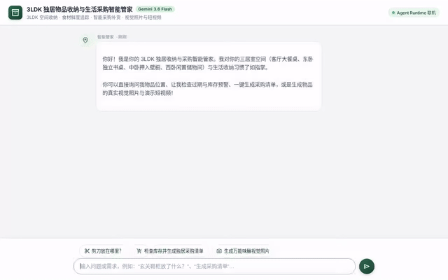

# 🏠 3LDK 独居物品收纳与生活采购智能管家 (Home Inventory Butler)

> 基于 Google Gemini 3.6 与 Vertex AI Agent Engine 构建的现代化 3LDK 空间收纳、食材保鲜与生活采购全能管家 Agent。



---

## 🌟 项目简介 (Overview)

对于独居青年而言，3LDK（三室一厅）的大空间往往伴随着“**物品放哪找不着**”、“**同一件小工具重复购买**”、“**冰箱食材悄悄过期**”以及“**去趟超市不知道该补什么**”的痛点。

**3LDK 独居物品收纳与生活采购智能管家** 专为解决这一系列独居居住痛点打造：
- **空间认知与物品多点定位**：深入认知 3LDK 的具体家具与功能分区（客厅大餐桌、东卧 1 米独立书桌、中卧巨大押入壁橱、西卧闲置储物间、玄关收纳挂钩与鞋柜），精准记录并指引剪刀、印章、遥控器等多点放置物品。
- **食材保鲜与临期监控**：实时追踪冰箱与常温食材存储周期，提供科学储藏方案，防止食材变质浪费。
- **独居专属智能补货**：一键审计库存与过期状态，自动计算紧急度，生成清晰条理的 Markdown 采购清单。
- **多模态生图与视频展示**：利用 Gemini 视觉模型即时生成空间收纳布局示意图与物品动态短视频。

---

## 🚀 核心特性 (Key Features)

1. **精确物品与空间检索 (`search_item` / `query_inventory_from_firestore`)**
   - 告别盲目翻找，秒级定位物品位于哪个房间、哪件家具、第几层抽屉，并汇报当前库存余量。
2. **自动化采购清单生成 (`generate_replenishment_shopping_list`)**
   - 区分【🚨 紧急补充】与【📦 常规备货】，根据独居单人消耗速率智能核算推荐购买量与预估单价。
3. **科学储藏建议与变质预警 (`get_storage_advice` / `check_inventory_alerts`)**
   - 针对不同食材（根茎类、绿叶菜、调味品、乳制品）给出精准温湿度分区建议，区分在用量与西卧大宗囤货。
4. **视觉照片与动态短视频双重生成 (`generate_item_image` / `generate_item_video`)**
   - **生图能力**：调用全球区域 `gemini-3.1-flash-lite-image`，生成日系极简风格的高清物品展示图。
   - **短视频能力**：集成 Google Omni 模型（`gemini-omni-flash-preview`），生成丝滑镜头动态短视频，并直传公网 Cloud Storage。
5. **结构化卡片交互 (A2UI v0.8)**
   - 自动渲染层次分明的信息卡片、位置徽章、色彩分明的预警表格与物品图片。
6. **3LDK 交互式空间鸟瞰图 (Interactive Floorplan Explorer)**
   - 前端集成 3LDK 户型交互视图（玄关、LDK 客餐厨、东卧书房、中卧起居室、西卧储物间），点击区域卡片实现一键空间收纳穿梭检索。
7. **多模态实物与小票拍照识别 (Multimodal Vision Intake)**
   - 支持直接拍照或上传超市收据、实物包装，基于 Gemini 多模态视觉能力自动识别品名、数量与保质期，一键录入云端 Firestore。
8. **交互式采购待办清单与即时核销 (Interactive Checklist & Stock Sync)**
   - 超市采购时，在界面中直接点击条目打勾划线，一键回传 Agent 智能核销并扣减/刷新库存状态。
9. **食品临期彩色进度条 (Freshness & Expiry Progress Visuals)**
   - 为食材引入红/黄/绿三色保鲜进度条，一眼识别 3 天内临期食材，彻底杜绝冰箱积压浪费。
10. **中英日全语言无缝支持 (Trilingual: Japanese, English, Chinese)**
    - 原生支持 **中文 (Chinese)**、**日本語 (Japanese)** 与 **English** 三语自由切换，无论是 UI 界面还是底层 Agent 均能以对应语言精准流利交互。

---


## 🛠️ Google Cloud 技术栈矩阵 (Google Cloud Architecture)

| 技术组件 | 角色与用途 | 详细说明 |
| :--- | :--- | :--- |
| **Google Gemini 3.6 Flash** | 核心推理大脑 | 负责多轮上下文理解、意图分发、工具调用与高质量中文交互 |
| **Vertex AI Agent Engine** | Agent 运行时托管 | 基于 Reasoning Engine 规范托管高可用无服务器 Agent 实例与 A2A 协议通信 |
| **Vertex AI Memory Bank** | 跨会话长期记忆 | 持久化记住主人的生活习惯、饮食偏好、品牌喜好与空间调整记录 |
| **Agent Engine Code Sandbox** | 安全代码沙箱环境 | 安全执行 Python 代码，用于精确保质期倒计时计算与采购预算汇总 |
| **Cloud Firestore** | 云端结构化状态存储 | 实时持久化 3LDK 全屋物品详情、房间归属、保质期与当前数量 |
| **Google Cloud Storage (GCS)** | 多模态资产公共存储 | 存放 Agent 生成的高清物品照片与短视频流，提供公网 HTTPS 直链 |
| **Gemini 3.1 Flash-Lite Image** | 轻量级视觉生图模型 | 全球区域快速生成高质量日系家居收纳实物图 |
| **Gemini Omni Flash Preview** | 多模态短视频生成模型 | 基于文本描述直接生成物品与生活场景的高清 MP4 动态视频 |
| **A2UI (Agent to UI) v0.8** | 结构化前端交互规范 | 结合 Basic Catalog 将 Agent 意图以卡片（Cards）、行（Row）、列（Column）与图片形式直观渲染 |
| **FastAPI + A2A 1.0 Client** | 轻量级生产反向代理 | 桥接浏览器端与云端 Agent Runtime，负责鉴权、会话管理与数据流转 |
| **Google Cloud Run** | 前端与网关无服务器托管 | 弹性容器化部署，提供安全、低延迟的公网访问服务 |

---

## 📂 项目目录结构 (Repository Structure)

```text
.
├── app/
│   ├── agent.py               # 根 Agent 定义、A2UI Schema 注入与回调配置
│   ├── a2ui_utils.py          # A2UI 卡片协议转换拦截器
│   ├── firestore_tools.py     # Cloud Firestore 存取与采购清单生成工具
│   ├── image_tool.py          # Gemini 3.1 Flash-Lite Image 生图与 GCS 直传
│   ├── video_tool.py          # Google Omni 视频生成工具与 GCS 直传
│   └── tools.py               # 空间认知、储藏建议与库存预警算法
├── frontend/
│   ├── Dockerfile             # Cloud Run 生产容器构建文件
│   ├── main.py                # FastAPI A2A 1.0 协议反向代理
│   ├── requirements.txt       # 前端服务依赖项
│   └── static/
│       └── index.html         # 日系极简主题定制、3LDK 快捷问答按钮与 A2UI 渲染器
├── tests/
│   └── unit/                  # 全套自动化单元测试（12/12 Passed）
├── assets/
│   └── demo.gif               # 演示视频循环动图
├── project_brief.md           # 智能管家设计简报与户型设定
├── agents-cli-manifest.yaml   # Agent Engine 清单配置
├── pyproject.toml             # Python 项目与依赖管理
└── README.md                  # 项目全景技术文档
```

---

## 🏃 快速开始 (Quickstart)

### 1. 本地运行 Agent Dev Playground
```bash
uv run adk web --port 8000
```
访问 `http://localhost:8000/dev-ui/?app=app` 查看全功能可视化调试界面。

### 2. 启动定制前端
```bash
cd frontend
uv venv .venv && uv pip install -r requirements.txt
export AGENT_ENGINE_RESOURCE_NAME="projects/885543773610/locations/us-east1/reasoningEngines/233817744716333056"
export AGENT_DIRECTORY="app"
PORT=8080 .venv/bin/python main.py
```
访问 `http://localhost:8080/` 体验日系极简主题前端与 3LDK 快捷提示词。

### 3. 运行自动化测试
```bash
uv run pytest tests/unit
```

---

## 💡 前端体验与进阶优化建议 (UI Improvement Suggestions)

1. **多模态图片识别录入 (Vision Intake)**：在输入框添加相机/图片上传按钮，支持用户拍照直接识别物品并自动填入名称、保质期和推荐存放位置。
2. **交互式待办勾选回传 (Interactive A2UI Actions)**：将采购清单的 Checkbox 变为可交互组件，用户在前端打勾后，通过回调实时更新 Firestore 库存状态。
3. **3LDK 户型平面图联动 (Interactive Floorplan)**：在左侧增加 3LDK 交互式户型平面缩略图，点击“东卧书房”或“中卧壁橱”即可高亮并过滤该区域所有物品。
4. **保质期临期进度条 (Expiry Progress Bars)**：在物品卡片上添加直观的彩色剩余天数进度条（绿色安全、黄色临期、红色过期）。
