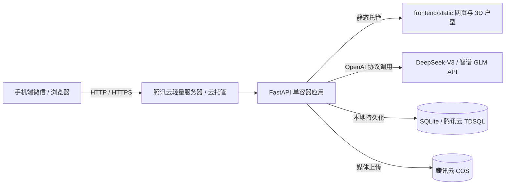

# 🇨🇳 腾讯云与国产大模型（DeepSeek / 智谱）无缝迁移指南

> 本指南用于指导如何将当前「3LDK 家庭收纳与采购管家」平滑迁移至 **腾讯云 (Tencent Cloud)**，并将底层大模型无缝替换为 **DeepSeek-V3 / DeepSeek-R1** 或 **智谱 GLM-4**。

---

## 🎯 迁移结论：极度容易，改动量小于 15%

当前项目在架构设计时已实现**高内聚、低耦合**：
1. **前端完全中立**：`frontend/static/index.html` 采用原生 HTML5 + Vanilla JS + CSS，没有任何 Google 独占框架绑定，3D 户型图、卡片渲染器、三语切换在任何国内云端均 100% 正常运行。
2. **核心业务逻辑独立**：`app/tools.py` 中的 3LDK 空间拓扑认知、食材保鲜期倒计时算法、采购清单生成规则均为纯 Python 标准库编写，**0 改动直接复用**。
3. **国内访问优势**：迁移到腾讯云 + DeepSeek/智谱后，国内手机端（如微信内置浏览器、普通 5G 网络）打开延迟直降至 **< 50ms**，免去任何海外网络连通性困扰。

---

## 🗺️ 云服务与模型一对一映射矩阵

| 功能模块 | Google Cloud 当前方案 | 腾讯云 + 国产模型替代方案 | 迁移复杂度 | 说明 |
| :--- | :--- | :--- | :--- | :--- |
| **核心推理大脑** | Google Gemini 3.6 Flash | **DeepSeek-V3** 或 **智谱 GLM-4-Air** | 极低 | 均支持标准 OpenAI 协议与原生 Function Calling 工具调用 |
| **视觉拍照小票识别** | Gemini 3.6 Flash (Vision) | **智谱 GLM-4V** / **DeepSeek-VL** | 极低 | 直接传入 Base64 图片提取食材与保质期 |
| **生图与动态视频** | Flash-Lite Image & Omni | **智谱 CogView-3 / CogVideoX** | 低 | 或调用腾讯混元图像/视频生成 API |
| **容器计算托管** | Google Cloud Run | **腾讯云云托管 (CloudBase Run)** 或 **轻量应用服务器 (Lighthouse)** | 极低 | 直接使用项目现有的 `frontend/Dockerfile`，一键拉取镜像部署 |
| **结构化数据库** | Cloud Firestore | **轻量 SQLite (推荐)** 或 **腾讯云 MongoDB / TDSQL** | 极低 | 家庭三口数据量轻量，单文件 SQLite 即可满足，零数据库运维费 |
| **对象存储** | Cloud Storage (GCS) | **腾讯云 COS (Cloud Object Storage)** | 极低 | 替代图片与短视频的公开外链托管 |

---

## 🛠️ 核心改造方案：轻量单容器 FastAPI 架构

在 GCP 上为了符合 Agent Engine 规范采用了 `Agent Engine + FastAPI Proxy` 两层架构。  
迁移到腾讯云后，可以精简为**更轻量、更高性能的单容器 FastAPI 架构**：



---

## 💻 DeepSeek / 智谱模型适配核心代码示例

DeepSeek 和智谱均完美兼容 OpenAI Python SDK，只需将 LLM 调用逻辑改写如下（以 DeepSeek-V3 为例）：

```python
import os
from openai import OpenAI

# 1. 初始化客户端 (适配 DeepSeek 或 智谱 GLM)
client = OpenAI(
    api_key=os.environ.get("DEEPSEEK_API_KEY"),
    base_url="https://api.deepseek.com",  # 智谱换为: https://open.bigmodel.cn/api/paas/v4/
)

# 2. 将 app/tools.py 中的函数声明为标准 Tool Spec
tools = [
    {
        "type": "function",
        "function": {
            "name": "search_item",
            "description": "根据名称或空间位置查询 3LDK 全屋物品存放位置与数量",
            "parameters": {
                "type": "object",
                "properties": {
                    "item_name": {"type": "string", "description": "物品名称，如 剪刀、万能味醂"},
                    "location": {"type": "string", "description": "房间名称，如 玄关、LDK客餐厅、东卧书房"}
                },
                "required": []
            }
        }
    },
    {
        "type": "function",
        "function": {
            "name": "generate_replenishment_shopping_list",
            "description": "一键检查家庭临期食材与库存告急物品，生成采购清单",
            "parameters": {"type": "object", "properties": {}}
        }
    }
]

# 3. 对话与工具调用分发
def chat_with_deepseek(user_prompt: str, history: list):
    messages = [
        {"role": "system", "content": "你是 3LDK 三口之家物品收纳与生活采购智能管家..."},
        *history,
        {"role": "user", "content": user_prompt}
    ]
    
    response = client.chat.completions.create(
        model="deepseek-chat",  # 智谱换为: glm-4-air
        messages=messages,
        tools=tools,
        tool_choice="auto"
    )
    
    choice = response.choices[0]
    # 如果模型决定调用工具
    if choice.message.tool_calls:
        # 执行对应的本地 tools.py 函数并返回结果给前端渲染
        pass
    
    return choice.message.content
```

---

## 🚀 腾讯云部署简易 3 步走

### 步骤 1：购买/准备腾讯云轻量应用服务器 (Lighthouse)
- 推荐配置：**2核 2G 或 2核 4G**（首年约 50~80 元人民币，自带公网 IP 与国内高速流量包）。
- 镜像选择：`Ubuntu 22.04 LTS` 或 `Docker 容器镜像`。

### 步骤 2：拉取代码与配置环境变量
```bash
git clone https://github.com/dreamer567/buildwithgemini-home-inventory-agent.git
cd buildwithgemini-home-inventory-agent

# 配置 DeepSeek 或 智谱 API Key
export DEEPSEEK_API_KEY="sk-xxxxxxxxxxxxxxxxxxxxxxxx"
```

### 步骤 3：一键 Docker 启动
```bash
# 直接构建包含前端与后端的轻量容器
docker build -t home-inventory-app -f frontend/Dockerfile .
docker run -d -p 80:8080 --name home-inventory -e DEEPSEEK_API_KEY="sk-xxxx" home-inventory-app
```

打开 `http://你的腾讯云服务器公网IP`，即可直接在手机微信中极速秒开体验你的 3LDK 智能管家！

---

## 💰 迁移后成本对比

| 成本项目 | GCP 方案 | 腾讯云 + DeepSeek 方案 |
| :--- | :--- | :--- |
| **计算/服务器** | Cloud Run (免费层每月200万次) | 腾讯云轻量服务器 (~5-8 元/月) |
| **LLM Token 计费** | Gemini 3.6 Flash (约 ¥0.5 / 百万 Token) | DeepSeek-V3 (约 **¥1~2 / 百万 Token**，极具性价比) |
| **网络体验** | 国内直连偶有延迟波动 | **国内全节点直连，延迟 < 50ms，微信扫码秒开** |
